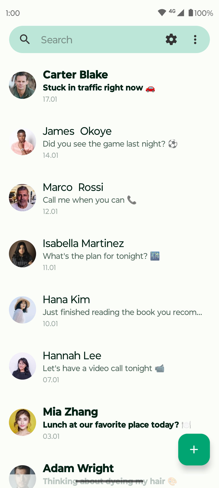
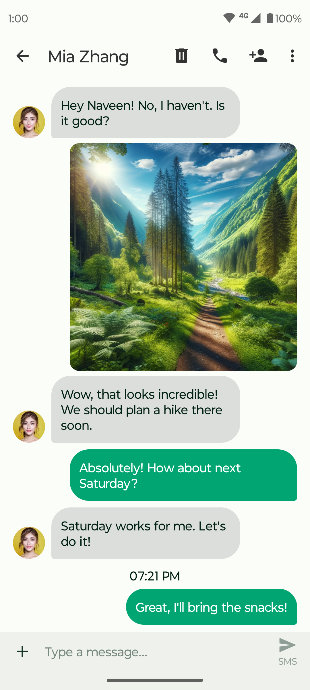
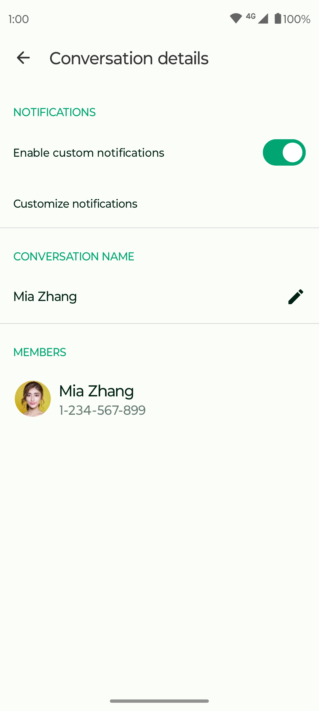

# Herotux Messages

Herotux Messages is a private, lightweight SMS and MMS messaging application designed to make everyday messaging simple and efficient.

**📱 STAY CONNECTED WITH EASE:**  
Send SMS and MMS messages, including group conversations, photos, emojis, and quick greetings.

**🚫 BLOCK UNWANTED MESSAGES:**  
Take control of your inbox with message blocking and tools for managing unwanted messages.

**🔒 SMS BACKUP:**  
Export and import your messages so you can keep important conversations when changing devices.

**🚀 LIGHTWEIGHT & FAST:**  
A focused messaging experience with a lightweight interface and fast everyday use.

**🔐 PRIVACY:**  
Control what appears on your lock screen and keep sensitive message content private.

**🔍 MESSAGE SEARCH:**  
Quickly find conversations and messages without scrolling through your entire inbox.

**🌈 MODERN DESIGN:**  
A clean Material-based interface with support for light and dark themes, folders, conversation labels, and customizable settings.

**🌐 OPEN SOURCE:**  
The project is open source and available for review and contribution on GitHub.

